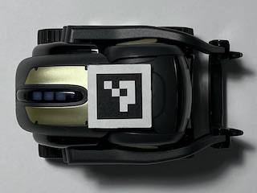
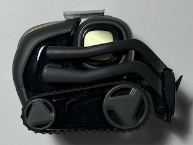

# Pose Estimation with ArUco Markers

This directory contains code for setting up a pose estimation server. Using an overhead camera, we detect ArUco markers installed on robots in the environment to get real-time 2D poses with millimeter-level precision.

## Initial Setup

Please see the main [`README.md`](../README.md) for requirements that should be installed via `pip`.

We use a [Logitech C930e webcam](https://www.amazon.com/Logitech-C930e-1080P-Video-Webcam/dp/B00CRJWW2G) as our overhead camera. While other cameras may work too, our setup is based on this particular camera. If you are using other cameras, the size of the environment may need to be modified to ensure reliable marker detection, especially if the camera FOV is low (the C930e has 90-degree FOV) or the camera image quality is worse. Also note that while the C930e supports 1080p, we run it at 720p. We found that when using 1080p, the latency would be too large, causing the robot controller to overshoot.

The code uses the serial number of your camera as an identifier for `cv2.VideoCapture` and for saving and loading camera parameters. On Ubuntu 18, you can get the serial number of your camera using either of the following commands:

```bash
lsusb -v -d 046d:0843 | grep iSerial
udevadm info -n video0 | grep ID_SERIAL_SHORT
```

## Camera Calibration

The camera needs to be calibrated in order to do accurate marker detection. We use the ChArUco board to calibrate our camera. You can generate a printable ChArUco board using the following command, which outputs a PDF file to [`printouts/charuco-board.pdf`](printouts/charuco-board.pdf).

```bash
python create_charuco_board.py
```

After printing, be sure to check that the squares are actually 24 mm wide, as some printers will rescale the document before printing.

To do the calibration, we provide a calibration script based on the [official example](https://github.com/opencv/opencv_contrib/blob/master/modules/aruco/samples/calibrate_camera_charuco.cpp). Run the following command, replacing `SERIAL` with your camera's serial.

```bash
python calibrate_charuco.py --serial SERIAL
```

The ChArUco board should be kept as flat as possible (by using a clipboard, for example). After calibration, the computed camera parameters will be saved to a config file in `camera_params`.

For more information on camera calibration with ChArUco boards, please see the [official tutorial](https://docs.opencv.org/4.4.0/da/d13/tutorial_aruco_calibration.html). You may also find [this list](https://calib.io/blogs/knowledge-base/calibration-best-practices) (backup [here](calibration-best-practices.txt)) of calibration best practices to be helpful.

## Marker Placement

To create printable markers for the robot and the board corners, run the following command, which will generate several printable marker sheets in [`printouts`](printouts).

```bash
python create_markers.py
```

We printed the markers on [label paper](https://www.amazon.com/AmazonBasics-Address-Labels-Inkjet-Printers/dp/B074KQRJKN), allowing us to cut the markers out and easily install them. As with the ChArUco board, be sure to measure the printed markers in case the document was rescaled during printing. The markers should be 18 mm wide.

The `detect_markers.py` script will detect markers visible in the camera image, and is useful for verifying marker IDs and marker orientations. To use it, run the following command, again replacing `SERIAL` with your camera's serial.

```bash
python detect_markers.py --serial SERIAL
```

### Robot Markers

Since marker detection works best when markers are installed on a flat surface, we affixed robot markers to [acrylic squares](https://www.amazon.com/1-5mm-Clear-Miniature-Bases-Square/dp/B00MNMRFEW) before installing them on the robot. Marker IDs 0 through 9 are used for robots. See photos below for placement. The markers should be parallel to the horizontal plane.

 | 
:---: | :---:

### Corner Markers

The board corner markers are used as anchors for the corners of the real environment (tabletop/board) in image space. There are two sets of board corner markers, one for the scattered objects at height 44 mm, and one for the robot at height 70 mm. By computing the positions of the robot in image space relative to the board corners, we can determine the 2D poses of the robot. Marker IDs 42 through 45 are used for the robot board corners, and 46 through 49 for object board corners. See photo below for placement.


:---:

## Camera Placement

The camera must be close enough to the tabletop to reliably detect all 8 board corner markers. We placed our camera approximately 74.5 cm above the tabletop. You can use the `detect_markers.py` script from before to check whether all of the board corners can be detected:

```bash
python detect_markers.py --serial SERIAL
```

It is very important that all board corner markers are reliably detected. Without accurate estimates of the board corner poses to anchor on, the pose estimates for the robot will not be accurate.

## Pose Estimation

Once the board setup is complete, you can run the following command to start the pose estimation server:

```bash
python server.py --serial SERIAL
```

Note that the server will not start running until a client connects. We provide `simple_client.py`, which you can use to make sure the server is outputting correct poses:

```bash
python simple_client.py
```

If no pose estimates are showing up in the client, the `--debug` flag can passed to the server to have it also show visualizations of the marker detections:

```bash
python server.py --debug
```

At this point, if the client is showing reasonable pose estimates, then the pose estimation server should be ready for use with the rest of the robot setup. Please see the main [`README.md`](../README.md) for further details.
